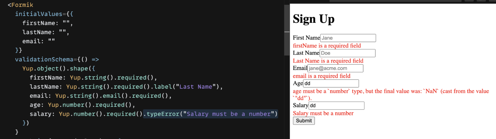
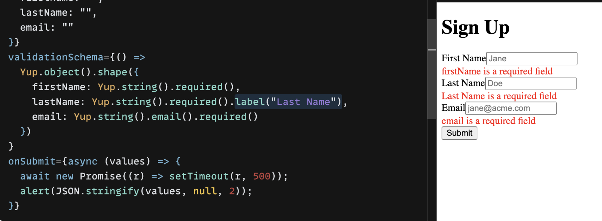
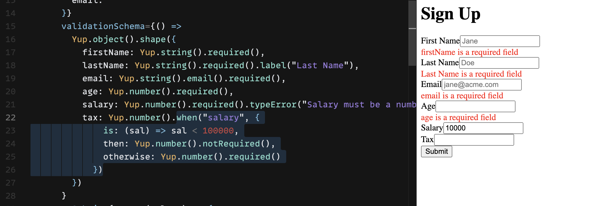
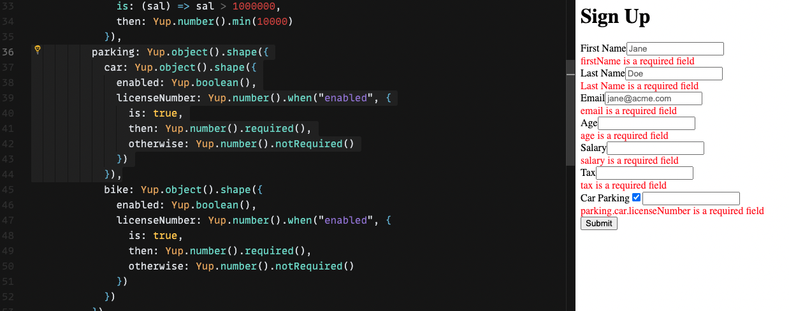
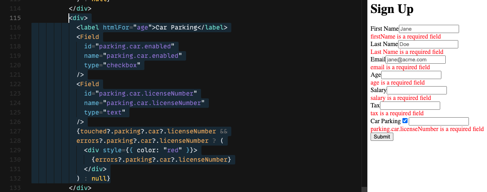
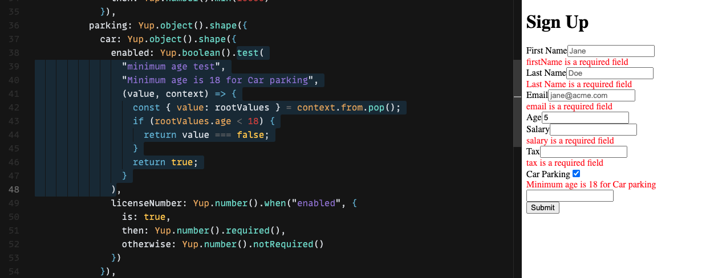

# Cheatsheet

Yup validation references that are not easy to find on yup documentation.

### Custom type errors
If type validation fails, give a custom error to display.
```js
Yup.number().typeError("Salary should be a number") })
```


### Field label for error
By default formik will show name given for the input element in error message. We can override it by providing custom label for field.
```js
Yup.number().min(0).max(99).required().label("Custom Label")
```


### Dependent Validations
Yup can validate fields based on values of other fields. For example if you have to validate Tax field should be required only when Salary > 100000.
```js
Yup.number().when("salary", {
        is: (sal) => sal < 100000,
        then: Yup.number().notRequired(),
        otherwise: Yup.number().required()
    })
```
Note: when() validations works across siblings. You can provide any other field that is sibling (on the same level) as the current field.


### Nested Object Validations
When you need to perform nested validations for a form having structure like `parking: { car: { enabled: true, licenseNumber: 1234 }}`. The "name" attribute on form fields can be set by destructuring with dots like `"parking.car.enabled"`
```js
parking: Yup.object().shape({
    car: Yup.object().shape({
        enabled: Yup.boolean(),
        licenseNumber: Yup.number().when("enabled", {
        is: true,
        then: Yup.number().required(),
        otherwise: Yup.number().notRequired()
    })
})
```



### Referring parent level field value in Yup validations
When we have a form structure like below and want to put validation for `car.parking.enabled` should be unchecked if age is less than 18.
```json
{
    firstName: "",
    lastName: "",
    email: "",
    parking: Object,
    car: {
        enabled: true
    },
    age: "33",
}
```

We can not access value for `age` in `when()` condition as it is on a parent level. We can use context object passed in `test()` method by yup.
```js
enabled: Yup.boolean().test(
                "minimum age test",
                "Minimum age is 18 for Car parking",
                (value, context) => {
                  const { value: rootValues } = context.from.pop();
                  if (rootValues.age < 18) {
                    return value === false;
                  }
                  return true;
                }
              ),
```


### 


